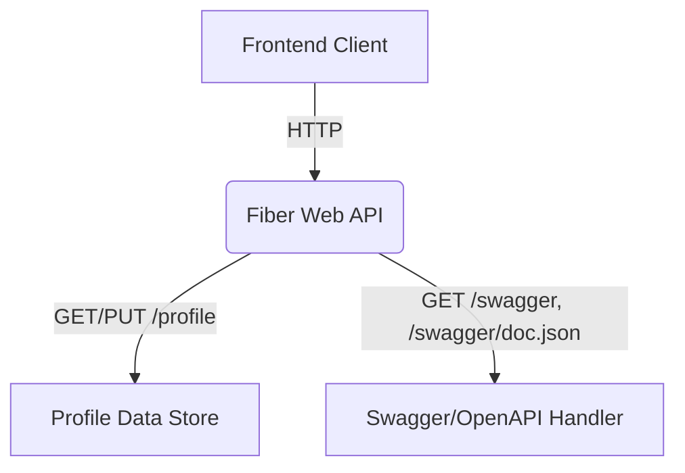

# C4 Diagram: go-example

## 1. System Context

This Go application provides a simple REST API for managing a user profile, intended for use in a workshop. It exposes endpoints for retrieving and updating profile information, and serves a minimal Swagger UI for API documentation.

**Primary Actors:**
- Frontend UI (e.g., web or mobile client)
- API consumer (developer, tester)

**System Boundary:**
- The Go service (Fiber web server)

**External Systems:**
- None (self-contained, no external DB or services)

---

## 2. Container Diagram

**Containers:**
- **Web API (Fiber app):**
  - Handles HTTP requests on `/`, `/profile`, `/swagger`, `/swagger/doc.json`
  - Serves static Swagger UI and OpenAPI JSON
  - Manages in-memory profile data (no persistent storage)

**Technology:**
- Go 1.x
- Fiber web framework
- In-memory data store (sync.RWMutex + struct)

---

## 3. Component Diagram

**Components:**
- **Profile Handler:**
  - GET `/profile`: Returns current profile as JSON
  - PUT `/profile`: Updates profile fields from JSON body
- **Swagger Handler:**
  - GET `/swagger`: Serves Swagger UI HTML
  - GET `/swagger/doc.json`: Serves OpenAPI spec
- **Profile Data Store:**
  - `Profile` struct, protected by RWMutex

---

## 4. Code Diagram (Mermaid)

---

## Summary Table

| Endpoint              | Method | Description                |
|-----------------------|--------|----------------------------|
| `/`                   | GET    | Hello world (test)         |
| `/profile`            | GET    | Get profile JSON           |
| `/profile`            | PUT    | Update profile JSON        |
| `/swagger`            | GET    | Swagger UI                 |
| `/swagger/doc.json`   | GET    | OpenAPI JSON               |

---

## Notes
- All data is in-memory; restarting the server resets the profile.
- No authentication or authorization is implemented.
- Swagger UI is served from CDN for convenience.
