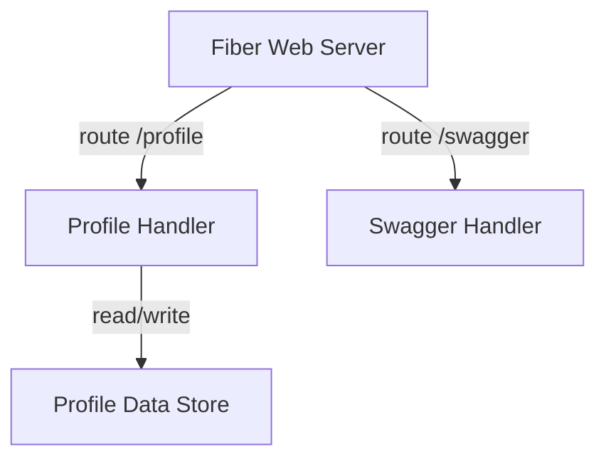
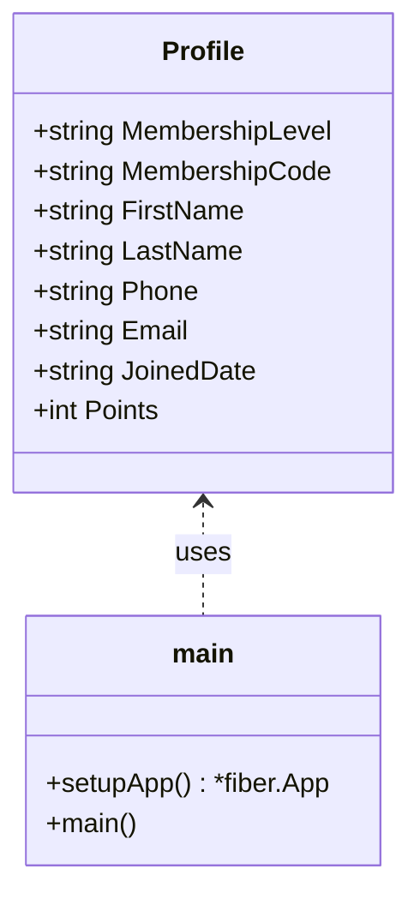

# C4 Diagram: go-example

## 1. System Context Diagram

**Description:**
ระบบนี้คือ REST API สำหรับจัดการข้อมูลโปรไฟล์ผู้ใช้ ใช้ใน workshop โดยมีผู้ใช้งานหลักคือ Frontend UI หรือ Developer ที่ต้องการทดสอบ API

```mermaid
flowchart TB
    User[User / Frontend Client]
    API[Profile API Service (Go + Fiber)]
    User -- HTTP/JSON --> API
```

- **User / Frontend Client**: ผู้ใช้งานหรือระบบอื่นที่เรียกใช้ API
- **Profile API Service**: ระบบที่ให้บริการ API (Go + Fiber)

---

## 2. Container Diagram

**Description:**
ระบบประกอบด้วย Container หลักคือ Web API (Fiber) ที่รับส่งข้อมูลผ่าน HTTP และจัดการข้อมูลโปรไฟล์ในหน่วยความจำ

```mermaid
flowchart TB
    subgraph Profile API Service
        A[Fiber Web Server]
        B[Profile Data Store (in-memory)]
        C[Swagger/OpenAPI Handler]
    end
    User[User / Frontend Client] -- HTTP --> A
    A -- read/write --> B
    A -- serve docs --> C
```

- **Fiber Web Server**: รับ request และจัดการ routing
- **Profile Data Store**: เก็บข้อมูลโปรไฟล์ในหน่วยความจำ
- **Swagger/OpenAPI Handler**: ให้บริการเอกสาร API

---

## 3. Component Diagram

**Description:**
แสดงส่วนประกอบภายใน Web API



- **Profile Handler**: จัดการ GET/PUT `/profile`
- **Swagger Handler**: จัดการ `/swagger` และ `/swagger/doc.json`
- **Profile Data Store**: โครงสร้างข้อมูลโปรไฟล์ (struct + mutex)

---

## 4. Code (Class) Diagram

**Description:**
แสดงโครงสร้างโค้ดหลักในระดับ struct/function



- **Profile struct**: โครงสร้างข้อมูลโปรไฟล์
- **main/setupApp**: ฟังก์ชันหลักสำหรับสร้างและรัน Fiber app

