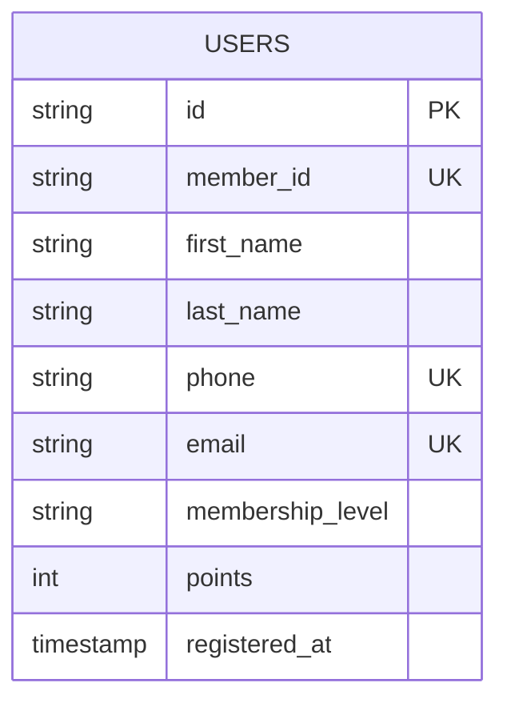

# Database Design

## Overview
This document describes the database design for the User Management System. The system is designed using Clean Architecture principles with a repository pattern for data access abstraction.

## Database Schema

### Users Table

The `users` table stores information about registered users in the system.

| Column Name | Data Type | Constraints | Description |
|-------------|-----------|-------------|-------------|
| `id` | VARCHAR(36) | PRIMARY KEY, NOT NULL | Unique identifier (UUID format) |
| `member_id` | VARCHAR(20) | UNIQUE, NOT NULL | Member ID in format LBK000001 |
| `first_name` | VARCHAR(100) | NOT NULL | User's first name |
| `last_name` | VARCHAR(100) | NOT NULL | User's last name |
| `phone` | VARCHAR(20) | UNIQUE, NOT NULL | Phone number with country code |
| `email` | VARCHAR(255) | UNIQUE, NOT NULL | Email address |
| `membership_level` | VARCHAR(20) | NOT NULL, DEFAULT 'Gold' | Membership tier (Gold, Silver, Bronze) |
| `points` | INTEGER | NOT NULL, DEFAULT 0 | Loyalty points balance |
| `registered_at` | TIMESTAMP | NOT NULL, DEFAULT CURRENT_TIMESTAMP | Registration timestamp |

### Indexes

```sql
-- Primary key (automatically created)
PRIMARY KEY (id)

-- Unique indexes for business constraints
CREATE UNIQUE INDEX idx_users_member_id ON users(member_id);
CREATE UNIQUE INDEX idx_users_email ON users(email);
CREATE UNIQUE INDEX idx_users_phone ON users(phone);

-- Performance indexes
CREATE INDEX idx_users_membership_level ON users(membership_level);
CREATE INDEX idx_users_registered_at ON users(registered_at);
```

## Entity Relationship Diagram



## Data Access Layer

### Repository Interface

The system uses the Repository pattern to abstract data access:

```go
type UserRepository interface {
    Create(user *entity.User) error
    GetByID(id string) (*entity.User, error)
    GetByEmail(email string) (*entity.User, error)
    GetAll() ([]*entity.User, error)
    Update(user *entity.User) error
    Delete(id string) error
}
```

### Current Implementation

- **Memory Repository**: In-memory storage using Go maps (for development/testing)
- **Future**: Database repository implementation (PostgreSQL/MySQL)

## Business Rules

### User Creation
- User ID must be a valid UUID
- Member ID must be unique and follow format LBK000001
- Email must be unique and valid format
- Phone number must be unique and include country code
- Default membership level is "Gold"
- Initial points balance is 0
- Registration timestamp is set to current time

### Data Validation
- All required fields must be non-empty
- Email format validation
- Phone number format validation
- Member ID format validation (LBK + 6 digits)

## Database Migration Scripts

### Initial Schema Creation

```sql
-- Create users table
CREATE TABLE users (
    id VARCHAR(36) PRIMARY KEY,
    member_id VARCHAR(20) UNIQUE NOT NULL,
    first_name VARCHAR(100) NOT NULL,
    last_name VARCHAR(100) NOT NULL,
    phone VARCHAR(20) UNIQUE NOT NULL,
    email VARCHAR(255) UNIQUE NOT NULL,
    membership_level VARCHAR(20) NOT NULL DEFAULT 'Gold',
    points INTEGER NOT NULL DEFAULT 0,
    registered_at TIMESTAMP NOT NULL DEFAULT CURRENT_TIMESTAMP
);

-- Create indexes
CREATE UNIQUE INDEX idx_users_member_id ON users(member_id);
CREATE UNIQUE INDEX idx_users_email ON users(email);
CREATE UNIQUE INDEX idx_users_phone ON users(phone);
CREATE INDEX idx_users_membership_level ON users(membership_level);
CREATE INDEX idx_users_registered_at ON users(registered_at);
```

## Performance Considerations

### Query Optimization
- Use indexes on frequently queried columns (email, phone, member_id)
- Consider composite indexes for common query patterns
- Regular maintenance of statistics for query planner

### Scalability
- Consider partitioning by registration date for large datasets
- Implement read replicas for read-heavy workloads
- Use connection pooling for database connections

## Security Considerations

### Data Protection
- Encrypt sensitive data at rest
- Use parameterized queries to prevent SQL injection
- Implement proper access controls and authentication

### Audit Trail
- Consider adding audit columns (created_by, updated_by, updated_at)
- Implement soft deletes if data retention is required
- Log all data modifications for compliance

## Future Enhancements

### Planned Features
- User roles and permissions
- User activity logging
- Password management
- Profile pictures and additional metadata
- User preferences and settings

### Schema Evolution
- Version control for database migrations
- Backward compatibility considerations
- Data migration strategies for schema changes
